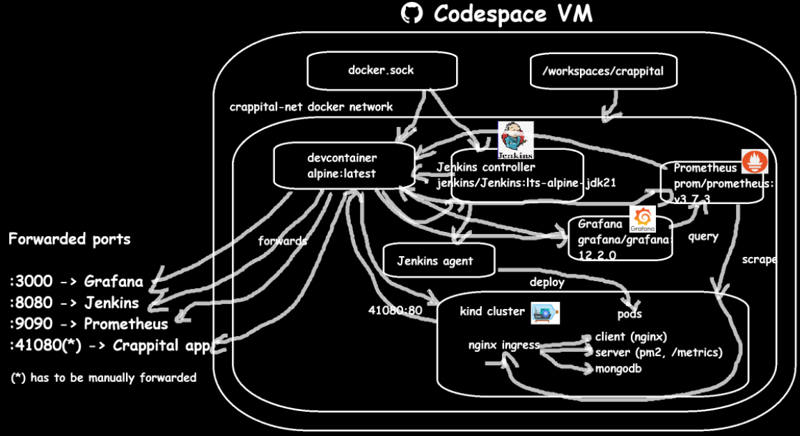
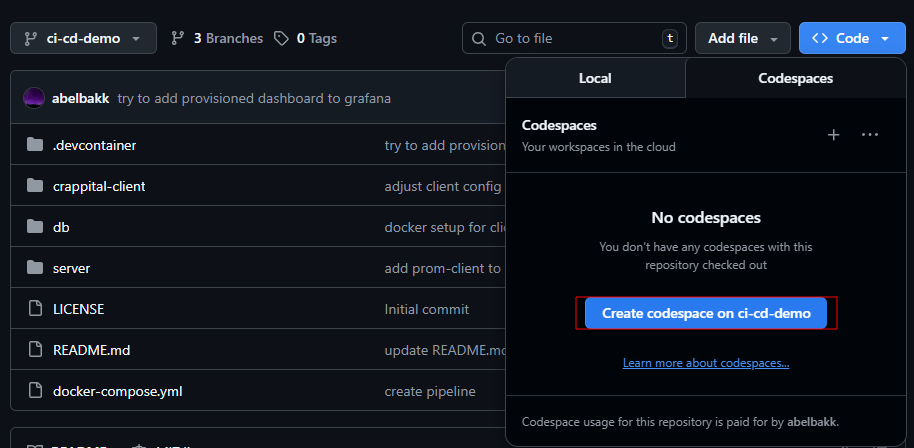
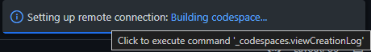
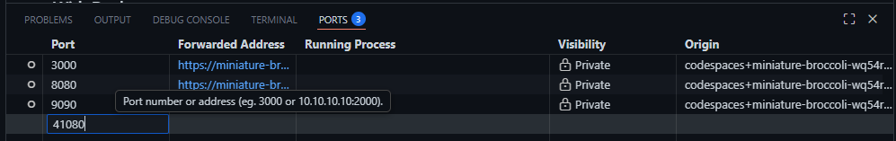
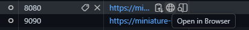
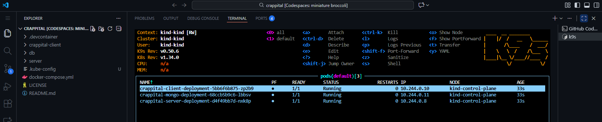
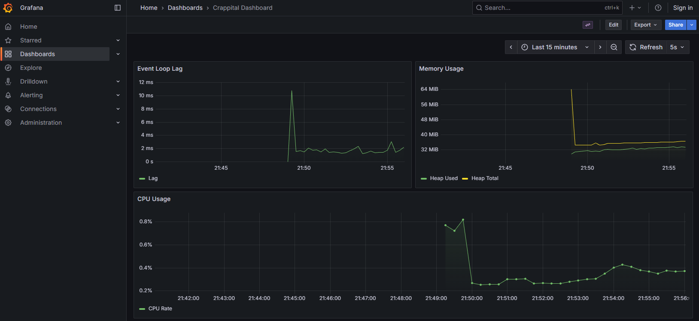

# SZTE, DevOps and Cloud Basics, Autumn 2025

Project made for the referenced course. It builds upon a previous application created for Program systems development in a previous semester. I've decided to put it into the same repository but on a different branch (ci-cd-demo, which is hopefully the default one now).

Most of the stuff that this project produced are structured into the `.devcontainer` directory. This is also what the project builds upon: I've tried to make it in a way that everything can be run using GitHub codespaces and also in a way that makes it reproducible: whenever a new devcontainer/codespace is booted up on this branch, after a while, everything should be configured for use. The application is not deployed by default, I'll go into details in the `Using the devcontainer` section. For the demo I plan to predeploy it since the Jenkins pipeline which deployes it to the cluster also takes a good few minutes. Most of the inspiration for this setup came from [this video](https://youtu.be/hh2K5XCN6Nk).

## Structure

```text
ipg3 :: crappital/git/.devcontainer ‹ci-cd-demo› » tree -L 4
.
├── Dockerfile.devcontainer # this is the image for the main workspace environment, based on alpine
                            # some CLI tools are installed that help manage the environment, like kubectl, kind, docker, helm, k9s
                            # this image is also used for the Jenkins agent
├── build
│   ├── client
│   │   ├── Dockerfile.deploy # container for the Angular frontend
│   │   └── nginx.conf # config for nginx, serves index.html and lets Angular handle the routing
│   └── server
│       └── Dockerfile.deploy # container for the server, installs pm2 and runs the built Node.js app
├── devcontainer.json # codespace config; sets root user, forwards ports, and runs the post-create script
├── docker-compose.yml # runs the platform services (Jenkins, Grafana, Prometheus) anddDevcontainer on a shared network with Docker socket access
├── grafana
│   └── provisioning
│       ├── dashboards
│       │   ├── crappital.json # json definition of the dashboard and visualisations for reproducibility
│       │   └── dashboard.yaml # configures Grafana to load dashboards from the local file system
│       └── datasources
│           └── datasource.yaml # configures Grafana to connect to the Prometheus container
├── jenkins
│   ├── Dockerfile.jenkins # custom Jenkins image; installs Docker CLI and plugins defined in plugins.txt
│   ├── Jenkinsfile # CI/CD pipeline script; defines build, test, and deploy stages
│   ├── casc.yml # configures Jenkins users, tools, and jobs automatically as code
│   └── plugins.txt # list of plugins to be installed in the Jenkins image
├── k8s
│   ├── 01-db.yaml # manifest for MongoDB deployment, service, and persistent storage claim
│   ├── 02-crappital.yaml # manifests for client and server deployments and services
│   └── 03-ingress.yaml # routing rules mapping URLs to the internal client and server services
├── kind-config.yaml # kind cluster config; maps internal port 80 to the host for browser access
├── post-create.sh # startup script; boots the cluster, adjusts networking/config, and installs the Ingress controller
└── prometheus
    └── prometheus.yml # configures Prometheus to scrape metrics from the cluster ingress

11 directories, 19 files
```

Additionally, I've had to make some changes to the application itself to make it viable for this environment:

- the client previously generated its API classes by asking the server for an `openapi.json` before it began its own build process; this had to be changed because having the client depend on the server in such a way is a bigger headache that I wanted to handle here (it's also probably not the best design choice): now it uses a hardcoded openapi.json
- I've added prom-client to the server and exposed default metrics through `/metrics`
- I've added some tests to the server (`server/tests/services/currencyService.test.ts`) so that there are some tests to run

I've also attempted to make a sketch of the different deployments and connections between them, but I haven't really succeeded, it's a bit of a mess. To simplify stuff, the same docker socket is passed around and everything is in one network, also most of the stuff (like the kubernetes cluster config) are simply stored in the workspace. It also may underrepresent or misrepresent some of the stuff (especially the forwarding magic codespaces does and how it manages containers inside the vm):



## Process

I've used the following tools (there are some additional ones, but those weren't listed in the course): Git, Docker, Jenkins, Nginx, Kubernetes (through Kind), Prometheus, Grafana.

I also attempted to use minikube, since that is included in Microsoft's default devcontainer image, but I had a lot of trouble configuring it and also ran into memory issues and just performance issues in general. Kind seems to consume a less resources and can boot up faster, at least in my experience.

## Using the devcontainer

!!! WARNING !!!: While GitHub provides free credits/hours for Codespaces, if that is exceeded, it costs money, which (if I understand correctly) is deducted from whoever creates the codespace they use based on a repo, not the owner of the repository. Please use with caution. In my experience, whatever GitHub provides for this was/is more than enough, I've booted up at least 80 different instances during development (not at the same time, of course), used them for no more than 20-30 minutes at max and then deleted them. They should also stop after X time units of inactivity and that way they do not get recreated from scratch. If this proves to be an issue, I can create a video using the devcontainer.

I recommend the following workflow to explore this project:

- A new codespace can be created based on the branch using Code -> Codespaces -> Create codespace on ci-cd-demo.
- 
- This opens a new window and starts setting up the Codespace. The creation log can also be accessed, this way it can be known when it completes for good. This can take some time as it downloads every image and creates the Kind cluster.
- 
- Once everything is ready, navigating to the Ports window shows the ports forwarded by the container. The app itself (which will be deployed to the cluster) is missing. I couldn't auto forward that unfortunately, because of a race condition: the port 41080 would already be forwarded by the time the cluster tries to use it and it would be seen by the cluster as in use. This one needs to be added to the ports so that the app can be accessed later; while it isn't deployed it doesn't do much, of course. Go to Ports -> Add port and add 41080.
- 
- Here the other option would've been to auto forward the port and then forward it from the cluster later, but this seemed like the simpler option from a user POV.
- If a bash terminal is opened in vscode, k9s can be used to see the current state of the cluster (it is aliased to use the .kube-config which gets created in the repo). It should be empty, but working. There are numerous shortcuts to make everything work, for example the cluster config, which gets created in the root of the workspace. Perhaps not the nicest solution, but this way it's easier to make it available for e.g. Jenkins.
- First step is to deploy the application to the cluster. This can be done by running a Jenkins pipeline. That pulls the repo from GitHub, installs, builds, tests them, builds some release Docker images and then deploys those to the kind cluster.
- To do this, navigate to Ports, and then forward Jenkins to the local browser. It runs on port 8080.
- 
- The user should be greeted with the Jenkins login screen, the user `admin` can be used, the password is the same (at this point it's probably worth mentioning that there are also numerous not-so-nice security shortcuts as well). Jenkins is set up automatically using its configuration as code plugin.
- A new build using the crappital pipeline can be started. This does every step automatically, once it succeeds, the state of the latest commit on this repo's ci-cd-demo branch should be deployed to the cluster.
- If this step is successful and we go back to the devcontainer vscode, using k9s we can see that there are pods deployed to the cluster.
- 
- At this point, one can access the application itself before moving to monitoring to make sure it is loaded. Again, one can navigate to the Ports and this time use 41080 to forward it to their browser.
- This opens the crappital application, which is also functional. At the bottom of this README, some more info about initial data in it can be found, but a quick hint: the user `berndw at crappital dot com` can be used, the password being the name of the app, all lowercase. But probably loading the app is enough. Nginx is used as ingress to handle the different requests against this port, the server metrics and openapi are also exposed, for example.
- Prometheus is set up by default to scrape the server (kind-control-plane:80/metrics). It uses the internal port instead of 41080. I haven't done much else with Prometheus, but it can be opened, again by navigating to ports and forwarding it to the user's browser.
- Finally, Grafana is also set up with a few dashboards, the data source being Prometheus. To access Grafana, port 3000 has to be forwarded to the browser. It shouldn't require authentication, but if it does, the same credentials can be used that were used before for Jenkins. Navigating to Dashboards -> Crappital Dashboard shows the dashboard.
- 

# crappital

Program systems development @ SZTE 2025

The fake netbank app is built on the MEAN stack:

- MongoDB
- NodeJS, TS, Express server
- Angular

## Initial data

For demonstration purposes, there are users as well as entities of each type that are created whenever the MongoDB container is created. For specific stuff, see `db/data.js`. Password for all users is `Y3JhcHBpdGFs` (Base64-encoded here, requires decoding first).
